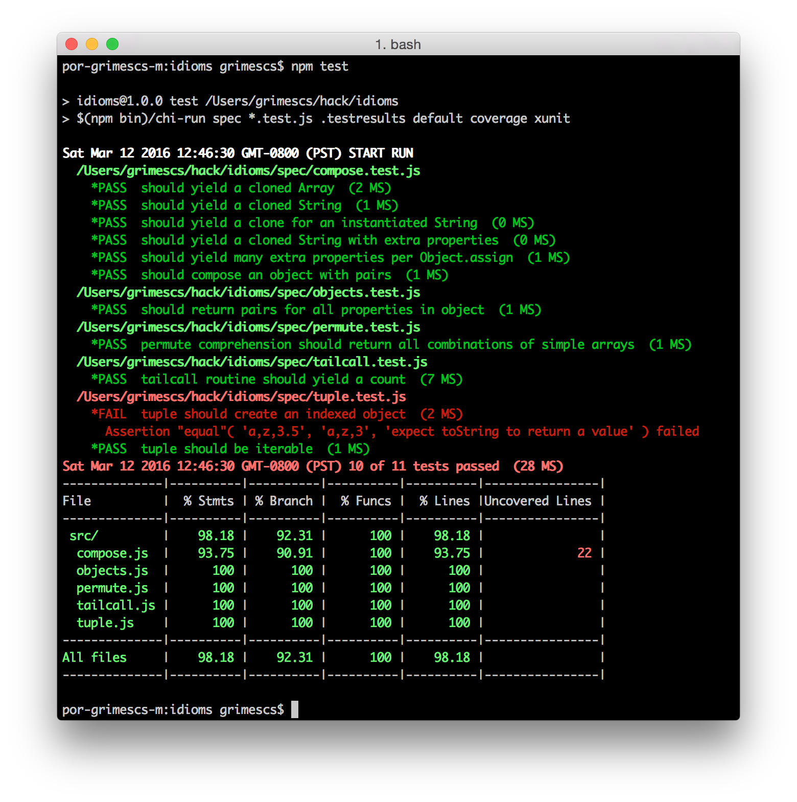

# Chihuahua
*Lightweight unit test library* [](https://travis-ci.org/csgrimes1/chihuahua-tester)


Most (if not all) unit test modules are frameworks rather than libraries. A Chihuahua is tiny, but it can 
navigate a dog park full of larger canines. Like the dog breed, Chihuahua the library is a small footprint
module that stacks up well against the frameworks. Chihuahua does one thing really well: it runs tests.
When complete, the results are stored as an intuitive block
of JSON in a configurable folder. This library does not contain anything but a default reporter, designed to
help you test quickly and identify the cause of test failures. It supports custom reporting as an
external operation - anyone can write a script to pick up and format the test log. You can also use the 
`chihuahua-reporters` module.

The library does not concern itself with TDD or BDD semantics. In keeping everything simple and small,
it is designed for programmers to write and run tests. It is also designed to help quickly locate a
problem when a test fails. Many test frameworks and assertion libraries rely on syntactic tricks that
don't really make code read like code to us professional coders! You may use any assertion library you
like with `chihuahua`, but I just use the canned routines that wrap the NodeJS `assert` module.

Sample output, including coverage:



### Good Things Can Come From Small Packages

Small is good with NPM modules. In the day and age of microservices, we often create ironically large dependency
trees in the node_modules folder. Often, the size of the tree is a result of secondhand dependencies.
It's a developer's choice whether to host a large dependency tree. However, Chihuahua
should not _impose_ slow NPM installs on the developer. If you are Dockerizing
your Node application, you'll endure significant wait times from `npm install` already. Therefore, it's good to
keep the node_modules at a minimum in Chihuahua.

This library is small, and here is why:

1. The CLI finds tests using STDIN rather than a glob expression. Nothing against globs, but glob libraries
bring many nested dependencies, adding weight to the package. It's quite easy to pipe the `ls` command
to Chihuahua. The module may add globbing support in the future if it can do so without adding
weight to the package.
2. There are no built-in reporters except a simple console dump (it can be turned off). The library also dumps a JSON log
to disk. It would be easy to write reporters to read and format the JSON log, and the external `chihuahua-reporters`
module already supports `xunit`.

### Task Runners

In the spirit of smallness, I should mention that I don't use Grunt or Gulp. If you need to run tasks across incompatible
shells like Bash and DOS, you may need Gulp or Grunt. When your project allows, shell scripts are a great way to
tool your source code. You really don't need a scaffold to get a Node project up and ready for code. Rather than
relying on Gulp, Grunt, or any task runner, Chihuahua has a simple command line interface ready for shell
scripting. You can also `require('chihuahua-tester')` and run it with JavaScript.

### Installing

Chihuahua is written in Ecmascript 6. If your NodeJS version does not support arrow
functions, generators, const, let, etc., Chihuahua won't run.

```
npm install chihuahua-tester --save-dev
```

If you need `xunit` output for you build process to digest, you can also install the
`chihuahua-reporters` module.

```
npm install chihuahua-reporters --save-dev
```

If you want to run coverage, install the NYC module. It can be installed globally or
inside of your project. The reporters module also helps to integrate reporters with
coverage. Though you can use NYC to launch `chihuahua` without it, I recommend
installing the reporters module for managing coverage.

### Structure of a Test Module

```javascript

'use strict';

module.exports = {
    beforeTest: t => {
        const timeout = 1000,
            promise = new Promise(resolve => {
                setTimeout(() => resolve(1 + 2), 500);
            });
        //Anything passed as 3rd arg will be wrapped in a promise using Promise.resolve(...).
        //Per Promise.resolve's semantics, the parameter can be a promise or a non-promise.
        return t.createContext('shortname', 'long description', promise, timeout);
    },

    afterTest: context => {
        return new Promise(resolve => {
            setTimeout(resolve, 500);
        });
    },

    tests: {
        'description 1': context => {
            return new Promise(resolve => {
                setTimeout(()=> {
                    context.equal(context.userData, 3);
                    resolve();
                }, 500);
            });
        },
        'description 2': context => {
            const testResult = context.userData + 1,
                expectedValue = 4;

            context.ok(true, 'always passes');
            context.equal(testResult, expectedValue, 'expect a result of 4');
        }
    }
};

```

You are required to export a `beforeTest` function taking one argument from each
test module. At the end of this setup function, you call and return the result
of `t.createContext`. The API is documented in detail below. 

Tests are defined in `module.exports.tests`. Each key of the object's properties
is a test description, and each value is a function taking one parameter.

Note that Chihuahua does not make you call any function to mark the end of
your tests. Every `beforeTest` and test function is built for promises. Simply
return a promise from a function to make Chihuahua wait it out.

### Running

If your tests are in the folder `spec` and you do _not_ have `chihuahua-reporters`
installed:

```
ls -1 spec/*.js | node $(npm bin)/runsuite --consoleOutput=true --output-dir=./.testresults
```

If you installed the reporters module, a typical test command would be:

```
$(npm bin)/chi-run spec *.test.js .testresults default coverage xunit
```

In either case, you can plug this command line into the `package.json` as your
test script, allowing you to run `npm test` from a terminal or script.

---

### API

#### Your Module

`module.exports.beforeTest = function(t) { ... }`

 * `t` Instance of `TestInitialization`.
 * This function _must_ return `t.createContext(...)`.
 
`module.exports.afterTest = function(context) { ... }` (optional)

 * `context` is an instance of TestContext.
 * The function is not required to return any value if it runs synchronously.
 * The function may return a promise, and if it does, the test runner will
 wait it out. The wait timeout is the `timeout` field of the context.
 
`module.exports.tests` Object defining tests

 * Each property name is a test description.
 * Each property value is a function taking a single argument, an
 instance of `TestContext`.
 * A test function is not required to return any value if it runs synchronously.
 * A test function may return a promise, and if it does, the test runner will
 wait it out. The wait timeout is the `timeout` field of the context.
 
#### TestInitialization

`TestInitialization.createContext(suite, description, userData, timeout)`

 * `suite` Name of test module.
 * `description` Verbose description of test module.
 * `userData` Test setup data, such as mocks. This parameter can be a promise
 or a non-promise. When it is a promise, it will be resolved and its value
 will be passed to the tests in the `userData` field of the `TestContext`.
 * `timeout` Optional timeout value, defaulting to 5000 ms.
 
#### TestContext

 * Property `userData`  Data created during setup phase in `beforeTest`.
 * Assertion functions. All of the assertions are wrappers on the
 NodeJS [assert module](https://nodejs.org/dist/latest-v4.x/docs/api/assert.html) functions.
 
#### Running the Module Without the CLI

```
const chihuahua = require('chihuahua-tester'),
    tests = ['spec/test1', 'spec/test2'],
    options = {
        consoleOutput: true,
        outputDir:     './.testresults'
    };

chihuahua.runModules(tests, options);
```

The example shows briefly how the CLI uses the API. The module API contains one function:

`chihuahua.runModules(files, options)`

 * `files` List of test files to run, relative to the project root.
 * `options` 
   * `consoleOutput` option (`--console-output` option in the CLI) controls
    display of the default reporter output. Default: `true`.
   * `outputDir` (`--output-dir` in the CLI) is the directory for report output, relative to the project
   root.

If you use Grunt to run your test suite, you do not need a task runner module. It is
possible to just `require('chihuahua-tester')` in your Gruntfile, then code a task
that calls `runModules`.

---

### Creating a new test

```
# Create a ./specs/testfile.js test module with sample code
node $(npm bin)/newTest specs testfile
# Create a ./specs/simpletest.js as a minimal module
node $(npm bin)/newTest specs simpletest bare
```
*Hint*: You should write a shell script and put it in your source code. Here
is an example named ./toolbin/newtest.sh:

```
# !/usr/bin/env bash
# Assume the test scripts are in the directory ./spec
$(npm bin)/newtest spec $1 bare
```

Remember to set execute permission on the file after you create it:

```
chmod +x toolbin/newtest.sh
```

Now run it:

```
toolbin/newtest.sh mynewtest
```

You should now have a file `./spec/mynewtest.js`.

---

### How it works

Chihuahua is built around the Ecmascript 6 promise. The `beforeTest`,
`afterTest`, and test functions can all return promises. If they do not return
promises, they are still treated as promises using the static Promise.resolve(...)
function.

The library supports test isolation. It reloads each module before running
each of its tests.

Chihuahua promotes structured testing. Each test must have a setup phase in
`beforeTest`. In contrast with other libraries using the _describe, before,
beforeEach, afterEach, after_ semantics, Chihuahua does not force you into using
mutable state variables shared between all of these stages of the test run.
Rather, `beforeTest` simply allows you to put custom user data in a context,
and that user data can be immutable.

### Features

 * You can print output to the console without affecting test reporters. Test
 output emits after the suite is completed.
 * You never have to use a callback to notify your test runners are complete.
 You can simply return promises rather than calling a `done` or `end` callback
 function.
 * Chihuahua gives you complete test isolation. Thanks to `proxyquire`, each
 test module is loaded before each test runs. This eliminates interference
 from other tests.

### History
* 1.0.2   2016-03-16 Initial release
* 1.0.3   2016-12-10 Fixes
    1. Fixed reporting error when reporting circular references
    2. Updates to NPM references
    3. Travis testing
* 1.0.4   2016-12-10 Fix
    1. Follow up on circular reference bug, setting max depth
* 1.0.5   2016-12-10 Log output
    1. Adjusting circular JSON max depth for log output.
